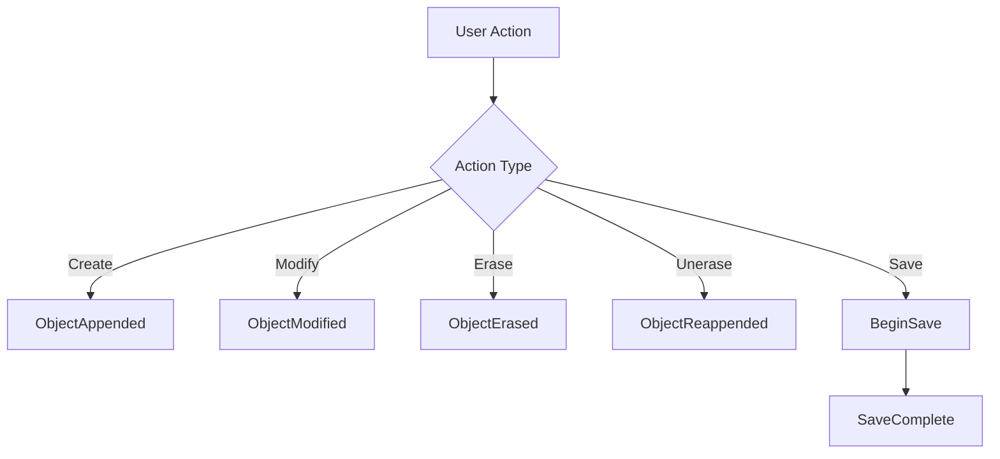

# Database Events

**Namespace:** `Autodesk.AutoCAD.DatabaseServices`  
**Assembly:** `AcDbMgd.dll`

## Overview

The `Database` class exposes numerous events that fire when database objects are created, modified, or deleted. These events enable reactive programming patterns where your code responds automatically to changes in the drawing.

**Key Concept:** Database events allow you to monitor and react to changes in the drawing database without polling. They're essential for maintaining data integrity, synchronization, and implementing custom behaviors.

## Event Categories

### Object Events
Events that fire when objects are added, modified, or erased.

### Transaction Events  
Events related to transaction lifecycle.

### Save/Load Events
Events that fire during drawing save and load operations.

### Modification Events
Events for tracking database modifications.

## Key Events

| Event | Description |
|-------|-------------|
| `ObjectAppended` | Fires when an object is added to the database |
| `ObjectErased` | Fires when an object is erased |
| `ObjectModified` | Fires when an object is modified |
| `ObjectReappended` | Fires when an erased object is unerased |
| `ObjectUnappended` | Fires when an appended object is removed |
| `ObjectOpenedForModify` | Fires when an object is opened for write |
| `BeginSave` | Fires before drawing is saved |
| `SaveComplete` | Fires after drawing is saved |
| `BeginDeepClone` | Fires before deep clone operation |
| `BeginDeepCloneTranslation` | Fires during deep clone translation |

## Common Usage Patterns

### 1. Monitoring Object Creation

```csharp
using Autodesk.AutoCAD.ApplicationServices;
using Autodesk.AutoCAD.DatabaseServices;
using Autodesk.AutoCAD.Runtime;

public class DatabaseEventHandler
{
    private Database _db;
    
    public void RegisterEvents()
    {
        Document doc = Application.DocumentManager.MdiActiveDocument;
        _db = doc.Database;
        
        _db.ObjectAppended += OnObjectAppended;
    }
    
    public void UnregisterEvents()
    {
        if (_db != null)
        {
            _db.ObjectAppended -= OnObjectAppended;
        }
    }
    
    private void OnObjectAppended(object sender, ObjectEventArgs e)
    {
        Document doc = Application.DocumentManager.MdiActiveDocument;
        Editor ed = doc.Editor;
        
        using (Transaction tr = _db.TransactionManager.StartTransaction())
        {
            DBObject obj = tr.GetObject(e.DBObject.ObjectId, OpenMode.ForRead);
            
            ed.WriteMessage($"\n>>> Object Added: {obj.GetType().Name}");
            
            if (obj is Entity ent)
            {
                ed.WriteMessage($" on layer '{ent.Layer}'");
            }
            
            tr.Commit();
        }
    }
}

[CommandMethod("STARTEVENTMON")]
public void StartEventMonitoring()
{
    DatabaseEventHandler handler = new DatabaseEventHandler();
    handler.RegisterEvents();
    
    Application.DocumentManager.MdiActiveDocument.Editor.WriteMessage(
        "\nEvent monitoring started. Draw something to see events fire.");
}
```

### 2. Tracking Object Modifications

```csharp
public class ModificationTracker
{
    private Database _db;
    private int _modificationCount = 0;
    
    public void Start()
    {
        _db = Application.DocumentManager.MdiActiveDocument.Database;
        _db.ObjectModified += OnObjectModified;
    }
    
    public void Stop()
    {
        if (_db != null)
        {
            _db.ObjectModified -= OnObjectModified;
            
            Editor ed = Application.DocumentManager.MdiActiveDocument.Editor;
            ed.WriteMessage($"\nTotal modifications tracked: {_modificationCount}");
        }
    }
    
    private void OnObjectModified(object sender, ObjectEventArgs e)
    {
        _modificationCount++;
        
        using (Transaction tr = _db.TransactionManager.StartTransaction())
        {
            DBObject obj = tr.GetObject(e.DBObject.ObjectId, OpenMode.ForRead);
            
            Editor ed = Application.DocumentManager.MdiActiveDocument.Editor;
            ed.WriteMessage($"\n>>> Modified: {obj.GetType().Name} (Total: {_modificationCount})");
            
            tr.Commit();
        }
    }
}
```

### 3. Monitoring Erase/Unerase Operations

```csharp
public class EraseMonitor
{
    private Database _db;
    
    public void RegisterEvents()
    {
        _db = Application.DocumentManager.MdiActiveDocument.Database;
        
        _db.ObjectErased += OnObjectErased;
        _db.ObjectReappended += OnObjectReappended;
    }
    
    private void OnObjectErased(object sender, ObjectErasedEventArgs e)
    {
        Editor ed = Application.DocumentManager.MdiActiveDocument.Editor;
        
        if (e.Erased)
        {
            ed.WriteMessage($"\n>>> Object ERASED: {e.DBObject.GetType().Name}");
        }
        else
        {
            ed.WriteMessage($"\n>>> Object UNERASED: {e.DBObject.GetType().Name}");
        }
    }
    
    private void OnObjectReappended(object sender, ObjectEventArgs e)
    {
        Editor ed = Application.DocumentManager.MdiActiveDocument.Editor;
        ed.WriteMessage($"\n>>> Object REAPPENDED: {e.DBObject.GetType().Name}");
    }
}
```

### 4. Save Event Handling

```csharp
public class SaveEventHandler
{
    private Database _db;
    
    public void RegisterEvents()
    {
        _db = Application.DocumentManager.MdiActiveDocument.Database;
        
        _db.BeginSave += OnBeginSave;
        _db.SaveComplete += OnSaveComplete;
    }
    
    private void OnBeginSave(object sender, DatabaseIOEventArgs e)
    {
        Editor ed = Application.DocumentManager.MdiActiveDocument.Editor;
        ed.WriteMessage($"\n>>> Begin Save: {e.FileName}");
        
        // Perform pre-save operations
        // e.g., validate data, update metadata, etc.
    }
    
    private void OnSaveComplete(object sender, DatabaseIOEventArgs e)
    {
        Editor ed = Application.DocumentManager.MdiActiveDocument.Editor;
        ed.WriteMessage($"\n>>> Save Complete: {e.FileName}");
        
        // Perform post-save operations
        // e.g., backup, logging, etc.
    }
}
```

### 5. Layer-Specific Object Monitoring

```csharp
public class LayerObjectMonitor
{
    private Database _db;
    private string _targetLayer;
    
    public LayerObjectMonitor(string layerName)
    {
        _targetLayer = layerName;
    }
    
    public void Start()
    {
        _db = Application.DocumentManager.MdiActiveDocument.Database;
        _db.ObjectAppended += OnObjectAppended;
    }
    
    public void Stop()
    {
        if (_db != null)
        {
            _db.ObjectAppended -= OnObjectAppended;
        }
    }
    
    private void OnObjectAppended(object sender, ObjectEventArgs e)
    {
        using (Transaction tr = _db.TransactionManager.StartTransaction())
        {
            DBObject obj = tr.GetObject(e.DBObject.ObjectId, OpenMode.ForRead);
            
            if (obj is Entity ent && ent.Layer == _targetLayer)
            {
                Editor ed = Application.DocumentManager.MdiActiveDocument.Editor;
                ed.WriteMessage($"\n>>> New {obj.GetType().Name} on layer '{_targetLayer}'");
                
                // Perform layer-specific logic
                // e.g., auto-assign properties, validate placement, etc.
            }
            
            tr.Commit();
        }
    }
}

[CommandMethod("MONITORLAYER")]
public void MonitorLayerCommand()
{
    Editor ed = Application.DocumentManager.MdiActiveDocument.Editor;
    
    PromptStringOptions pso = new PromptStringOptions("\nEnter layer name to monitor: ");
    PromptResult pr = ed.GetString(pso);
    
    if (pr.Status == PromptStatus.OK)
    {
        LayerObjectMonitor monitor = new LayerObjectMonitor(pr.StringResult);
        monitor.Start();
        
        ed.WriteMessage($"\nMonitoring layer '{pr.StringResult}'");
    }
}
```

### 6. Comprehensive Event Logger

```csharp
public class DatabaseEventLogger
{
    private Database _db;
    private System.IO.StreamWriter _logWriter;
    
    public void StartLogging(string logFilePath)
    {
        _db = Application.DocumentManager.MdiActiveDocument.Database;
        _logWriter = new System.IO.StreamWriter(logFilePath, true);
        
        // Register all major events
        _db.ObjectAppended += OnObjectAppended;
        _db.ObjectModified += OnObjectModified;
        _db.ObjectErased += OnObjectErased;
        _db.BeginSave += OnBeginSave;
        _db.SaveComplete += OnSaveComplete;
        
        LogEvent("Event logging started");
    }
    
    public void StopLogging()
    {
        if (_db != null)
        {
            _db.ObjectAppended -= OnObjectAppended;
            _db.ObjectModified -= OnObjectModified;
            _db.ObjectErased -= OnObjectErased;
            _db.BeginSave -= OnBeginSave;
            _db.SaveComplete -= OnSaveComplete;
        }
        
        if (_logWriter != null)
        {
            LogEvent("Event logging stopped");
            _logWriter.Close();
            _logWriter = null;
        }
    }
    
    private void LogEvent(string message)
    {
        string timestamp = DateTime.Now.ToString("yyyy-MM-dd HH:mm:ss.fff");
        _logWriter.WriteLine($"[{timestamp}] {message}");
        _logWriter.Flush();
    }
    
    private void OnObjectAppended(object sender, ObjectEventArgs e)
    {
        LogEvent($"APPENDED: {e.DBObject.GetType().Name} (ID: {e.DBObject.ObjectId})");
    }
    
    private void OnObjectModified(object sender, ObjectEventArgs e)
    {
        LogEvent($"MODIFIED: {e.DBObject.GetType().Name} (ID: {e.DBObject.ObjectId})");
    }
    
    private void OnObjectErased(object sender, ObjectErasedEventArgs e)
    {
        string action = e.Erased ? "ERASED" : "UNERASED";
        LogEvent($"{action}: {e.DBObject.GetType().Name} (ID: {e.DBObject.ObjectId})");
    }
    
    private void OnBeginSave(object sender, DatabaseIOEventArgs e)
    {
        LogEvent($"BEGIN SAVE: {e.FileName}");
    }
    
    private void OnSaveComplete(object sender, DatabaseIOEventArgs e)
    {
        LogEvent($"SAVE COMPLETE: {e.FileName}");
    }
}
```

## Event Lifecycle



## Best Practices

1. **Always unregister**: Remove event handlers when done to prevent memory leaks
2. **Use transactions**: Always use transactions when accessing objects in event handlers
3. **Avoid recursion**: Be careful not to trigger the same event within its handler
4. **Keep handlers fast**: Event handlers should execute quickly
5. **Handle exceptions**: Wrap event handler code in try-catch blocks
6. **Document-specific**: Register events per document, not globally

## Common Patterns

### Pattern 1: Register/Unregister
```csharp
// Register
_db.ObjectAppended += OnObjectAppended;

// Unregister (CRITICAL!)
_db.ObjectAppended -= OnObjectAppended;
```

### Pattern 2: Safe Object Access
```csharp
private void OnEvent(object sender, ObjectEventArgs e)
{
    using (Transaction tr = _db.TransactionManager.StartTransaction())
    {
        DBObject obj = tr.GetObject(e.DBObject.ObjectId, OpenMode.ForRead);
        // Process object
        tr.Commit();
    }
}
```

### Pattern 3: Conditional Processing
```csharp
private void OnObjectAppended(object sender, ObjectEventArgs e)
{
    if (e.DBObject is Circle)
    {
        // Process only circles
    }
}
```

## Common Pitfalls

❌ **Forgetting to unregister**: Causes memory leaks  
❌ **Modifying in event handler**: Can cause recursion  
❌ **Not using transactions**: Causes access violations  
❌ **Slow event handlers**: Degrades performance  
❌ **Global event handlers**: Should be document-specific

## Related Classes

- [Database](../Core/Database.md) - Exposes these events
- [ObjectEventArgs](ObjectEventArgs.md) - Event argument class
- [Transaction](../Transactions/Transaction.md) - Required for object access
- [Document](../Core/Document.md) - Document-level events

## See Also

- [Autodesk Official Documentation](https://help.autodesk.com/view/OARX/2024/ENU/?guid=GUID-DatabaseEvents)
