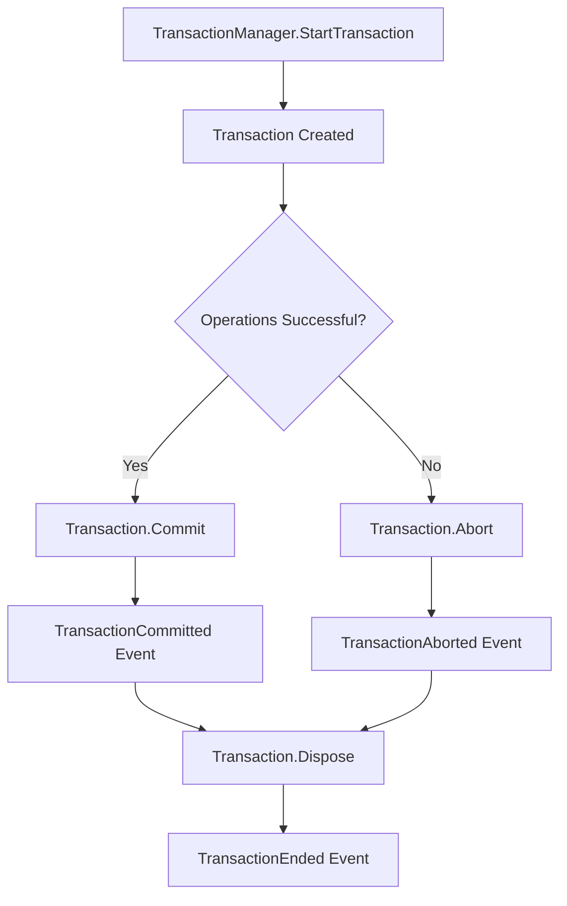

# TransactionManager

**Namespace:** `Autodesk.AutoCAD.DatabaseServices`  
**Assembly:** `AcDbMgd.dll`

## Overview

The `TransactionManager` class manages the lifecycle of transactions for a specific database. Each `Database` object has its own `TransactionManager` accessible via `Database.TransactionManager`. It controls transaction creation, nesting, and coordination.

## Class Hierarchy

```
Object
  └─ RXObject
      └─ TransactionManager
```

## Key Properties

| Property | Type | Description |
|----------|------|-------------|
| `TopTransaction` | `Transaction` | Gets the outermost (top-level) transaction |
| `NumberOfActiveTransactions` | `int` | Gets the count of currently active transactions |

## Key Methods

### Transaction Creation

| Method | Return Type | Description |
|--------|-------------|-------------|
| `StartTransaction()` | `Transaction` | Starts a new transaction |
| `StartOpenCloseTransaction()` | `OpenCloseTransaction` | Starts a simplified open/close transaction |

### Transaction Management

| Method | Return Type | Description |
|--------|-------------|-------------|
| `QueueForGraphicsFlush()` | `void` | Queues graphics update after transaction |
| `EnableGraphicsFlush(bool)` | `void` | Enables/disables automatic graphics updates |
| `FlushGraphics()` | `void` | Forces immediate graphics update |

### Events

| Event | Description |
|-------|-------------|
| `TransactionStarted` | Fired when a transaction starts |
| `TransactionEnded` | Fired when a transaction ends (commit or abort) |
| `TransactionAborted` | Fired when a transaction is aborted |
| `TransactionCommitted` | Fired when a transaction is committed |

## Common Usage Patterns

### 1. Basic Transaction Manager Access

```csharp
using Autodesk.AutoCAD.ApplicationServices;
using Autodesk.AutoCAD.DatabaseServices;
using Autodesk.AutoCAD.Runtime;

[CommandMethod("TRANSMAN")]
public void TransactionManagerExample()
{
    Document doc = Application.DocumentManager.MdiActiveDocument;
    Database db = doc.Database;
    Editor ed = doc.Editor;
    
    // Access transaction manager
    TransactionManager tm = db.TransactionManager;
    
    ed.WriteMessage($"\nActive transactions: {tm.NumberOfActiveTransactions}");
    
    using (Transaction tr = tm.StartTransaction())
    {
        ed.WriteMessage($"\nActive transactions: {tm.NumberOfActiveTransactions}");
        ed.WriteMessage($"\nTop transaction: {tm.TopTransaction != null}");
        
        tr.Commit();
    }
    
    ed.WriteMessage($"\nActive transactions after commit: {tm.NumberOfActiveTransactions}");
}
```

### 2. Monitoring Transaction Events

```csharp
[CommandMethod("MONITORTRANS")]
public void MonitorTransactionsExample()
{
    Document doc = Application.DocumentManager.MdiActiveDocument;
    Database db = doc.Database;
    Editor ed = doc.Editor;
    TransactionManager tm = db.TransactionManager;
    
    // Subscribe to events
    tm.TransactionStarted += (sender, e) => 
        ed.WriteMessage("\n>>> Transaction STARTED");
    
    tm.TransactionCommitted += (sender, e) => 
        ed.WriteMessage("\n>>> Transaction COMMITTED");
    
    tm.TransactionAborted += (sender, e) => 
        ed.WriteMessage("\n>>> Transaction ABORTED");
    
    // Perform some operations
    using (Transaction tr = tm.StartTransaction())
    {
        BlockTable bt = tr.GetObject(db.BlockTableId, OpenMode.ForRead) as BlockTable;
        ed.WriteMessage($"\n>>> Working with {bt.Count} blocks");
        tr.Commit();
    }
    
    // Cleanup (important!)
    // In production, store event handlers and unsubscribe when done
}
```

### 3. Nested Transaction Tracking

```csharp
[CommandMethod("NESTEDTRACK")]
public void NestedTransactionTracking()
{
    Document doc = Application.DocumentManager.MdiActiveDocument;
    Database db = doc.Database;
    Editor ed = doc.Editor;
    TransactionManager tm = db.TransactionManager;
    
    ed.WriteMessage($"\nInitial count: {tm.NumberOfActiveTransactions}");
    
    using (Transaction tr1 = tm.StartTransaction())
    {
        ed.WriteMessage($"\nAfter tr1: {tm.NumberOfActiveTransactions}");
        
        using (Transaction tr2 = tm.StartTransaction())
        {
            ed.WriteMessage($"\nAfter tr2: {tm.NumberOfActiveTransactions}");
            
            using (Transaction tr3 = tm.StartTransaction())
            {
                ed.WriteMessage($"\nAfter tr3: {tm.NumberOfActiveTransactions}");
                tr3.Commit();
            }
            
            ed.WriteMessage($"\nAfter tr3 commit: {tm.NumberOfActiveTransactions}");
            tr2.Commit();
        }
        
        ed.WriteMessage($"\nAfter tr2 commit: {tm.NumberOfActiveTransactions}");
        tr1.Commit();
    }
    
    ed.WriteMessage($"\nFinal count: {tm.NumberOfActiveTransactions}");
}
```

### 4. Graphics Flush Control

```csharp
[CommandMethod("GRAPHICSFLUSH")]
public void GraphicsFlushExample()
{
    Document doc = Application.DocumentManager.MdiActiveDocument;
    Database db = doc.Database;
    TransactionManager tm = db.TransactionManager;
    
    // Disable automatic graphics updates for performance
    tm.EnableGraphicsFlush(false);
    
    using (Transaction tr = tm.StartTransaction())
    {
        BlockTable bt = tr.GetObject(db.BlockTableId, OpenMode.ForRead) as BlockTable;
        BlockTableRecord btr = tr.GetObject(bt[BlockTableRecord.ModelSpace], 
            OpenMode.ForWrite) as BlockTableRecord;
        
        // Create many objects without updating graphics
        for (int i = 0; i < 1000; i++)
        {
            Circle circle = new Circle(
                new Point3d(i * 2, 0, 0), 
                Vector3d.ZAxis, 
                1.0
            );
            btr.AppendEntity(circle);
            tr.AddNewlyCreatedDBObject(circle, true);
        }
        
        tr.Commit();
    }
    
    // Re-enable and force update
    tm.EnableGraphicsFlush(true);
    tm.FlushGraphics();
    
    doc.Editor.WriteMessage("\nCreated 1000 circles with deferred graphics update");
}
```

### 5. Multi-Document Transaction Management

```csharp
[CommandMethod("MULTIDOC")]
public void MultiDocumentExample()
{
    DocumentCollection docs = Application.DocumentManager;
    Editor ed = docs.MdiActiveDocument.Editor;
    
    // Each document has its own transaction manager
    foreach (Document doc in docs)
    {
        Database db = doc.Database;
        TransactionManager tm = db.TransactionManager;
        
        ed.WriteMessage($"\nDocument: {doc.Name}");
        ed.WriteMessage($"\n  Active transactions: {tm.NumberOfActiveTransactions}");
    }
}
```

### 6. Safe Transaction Pattern with Manager

```csharp
[CommandMethod("SAFETM")]
public void SafeTransactionManagerPattern()
{
    Document doc = Application.DocumentManager.MdiActiveDocument;
    Database db = doc.Database;
    Editor ed = doc.Editor;
    TransactionManager tm = db.TransactionManager;
    
    // Check if transaction is already active (e.g., called from another command)
    if (tm.NumberOfActiveTransactions > 0)
    {
        ed.WriteMessage("\nWarning: Transaction already active!");
        ed.WriteMessage($"\nActive count: {tm.NumberOfActiveTransactions}");
    }
    
    using (Transaction tr = tm.StartTransaction())
    {
        try
        {
            // Your database operations here
            BlockTable bt = tr.GetObject(db.BlockTableId, OpenMode.ForRead) as BlockTable;
            ed.WriteMessage($"\nProcessing {bt.Count} blocks");
            
            tr.Commit();
        }
        catch (System.Exception ex)
        {
            ed.WriteMessage($"\nError: {ex.Message}");
            // Transaction will auto-abort
        }
    }
}
```

## Transaction Lifecycle



## Best Practices

1. **One transaction manager per database**: Never share transaction managers across databases
2. **Monitor active count**: Check `NumberOfActiveTransactions` to avoid conflicts
3. **Use events for debugging**: Subscribe to transaction events during development
4. **Disable graphics flush for bulk operations**: Improves performance significantly
5. **Always flush graphics after disabling**: Ensure UI updates after bulk operations
6. **Unsubscribe from events**: Prevent memory leaks by removing event handlers

## Performance Considerations

| Scenario | Recommendation |
|----------|----------------|
| Creating 1-10 objects | Use default graphics flush |
| Creating 100+ objects | Disable graphics flush, flush manually after commit |
| Reading many objects | Graphics flush doesn't apply |
| Nested transactions | Minimize nesting depth for clarity |
| Long-running operations | Consider breaking into smaller transactions |

## Common Patterns

### Pattern 1: Standard Transaction
```csharp
using (Transaction tr = db.TransactionManager.StartTransaction())
{
    // Operations
    tr.Commit();
}
```

### Pattern 2: Bulk Operations
```csharp
db.TransactionManager.EnableGraphicsFlush(false);
using (Transaction tr = db.TransactionManager.StartTransaction())
{
    // Bulk operations
    tr.Commit();
}
db.TransactionManager.EnableGraphicsFlush(true);
db.TransactionManager.FlushGraphics();
```

### Pattern 3: Event Monitoring
```csharp
var tm = db.TransactionManager;
tm.TransactionStarted += OnTransactionStarted;
try
{
    // Operations
}
finally
{
    tm.TransactionStarted -= OnTransactionStarted;
}
```

## Related Classes

- [Transaction](Transaction.md) - Individual transaction object
- [OpenCloseTransaction](OpenCloseTransaction.md) - Simplified transaction pattern
- [Database](../Core/Database.md) - Contains the transaction manager
- [DBObject](../BaseClasses/DBObject.md) - Objects managed by transactions

## See Also

- [Autodesk Official Documentation](https://help.autodesk.com/view/OARX/2024/ENU/?guid=GUID-5F8D8F3E-8E0A-4C3C-8787-862EAEF1DB3F)
