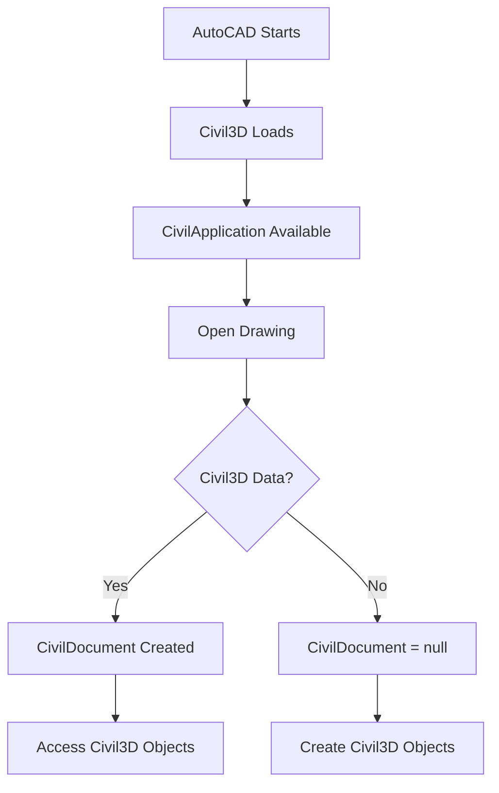

# CivilApplication

**Namespace:** `Autodesk.Civil.ApplicationServices`  
**Assembly:** `AeccDbMgd.dll`

## Overview

The `CivilApplication` class is the top-level entry point for accessing Civil3D functionality. It provides access to the active Civil3D document, application settings, and global Civil3D operations.

**Key Concept:** `CivilApplication` is the Civil3D equivalent of AutoCAD's `Application` class, providing Civil3D-specific application-level access.

## Class Hierarchy

```
Object
  └─ CivilApplication
```

## Key Properties

| Property | Type | Description |
|----------|------|-------------|
| `ActiveDocument` | `CivilDocument` | Gets the currently active Civil3D document |
| `Version` | `string` | Gets the Civil3D version string |

## Key Methods

| Method | Return Type | Description |
|--------|-------------|-------------|
| `GetCivilDocument(Database)` | `CivilDocument` | Gets the CivilDocument for a specific database |

## Common Usage Patterns

### 1. Accessing Active Civil3D Document

```csharp
using Autodesk.Civil.ApplicationServices;
using Autodesk.AutoCAD.ApplicationServices;
using Autodesk.AutoCAD.Runtime;

[CommandMethod("CIVILAPP")]
public void AccessCivilApplication()
{
    // Get active Civil3D document
    CivilDocument civilDoc = CivilApplication.ActiveDocument;
    
    if (civilDoc != null)
    {
        Editor ed = Application.DocumentManager.MdiActiveDocument.Editor;
        ed.WriteMessage($"\nCivil3D Document: {civilDoc.Name}");
        ed.WriteMessage($"\nCivil3D Version: {CivilApplication.Version}");
    }
}
```

### 2. Getting CivilDocument from Database

```csharp
[CommandMethod("GETcivildoc")]
public void GetCivilDocumentFromDatabase()
{
    Document acDoc = Application.DocumentManager.MdiActiveDocument;
    Database db = acDoc.Database;
    Editor ed = acDoc.Editor;
    
    // Method 1: From active document
    CivilDocument civilDoc1 = CivilApplication.ActiveDocument;
    
    // Method 2: From specific database
    CivilDocument civilDoc2 = CivilApplication.GetCivilDocument(db);
    
    ed.WriteMessage($"\nBoth methods return same document: {civilDoc1 == civilDoc2}");
}
```

### 3. Checking Civil3D Availability

```csharp
[CommandMethod("CHECKCIVIL")]
public void CheckCivil3DAvailability()
{
    Editor ed = Application.DocumentManager.MdiActiveDocument.Editor;
    
    try
    {
        CivilDocument civilDoc = CivilApplication.ActiveDocument;
        
        if (civilDoc != null)
        {
            ed.WriteMessage("\n✓ Civil3D is available");
            ed.WriteMessage($"\n  Version: {CivilApplication.Version}");
            ed.WriteMessage($"\n  Document: {civilDoc.Name}");
            
            // Check for Civil3D objects
            int alignmentCount = civilDoc.GetAlignmentIds().Count;
            int surfaceCount = civilDoc.GetSurfaceIds().Count;
            int networkCount = civilDoc.GetPipeNetworkIds().Count;
            
            ed.WriteMessage($"\n  Alignments: {alignmentCount}");
            ed.WriteMessage($"\n  Surfaces: {surfaceCount}");
            ed.WriteMessage($"\n  Pipe Networks: {networkCount}");
        }
        else
        {
            ed.WriteMessage("\n✗ Civil3D document not available");
        }
    }
    catch (System.Exception ex)
    {
        ed.WriteMessage($"\n✗ Civil3D not available: {ex.Message}");
    }
}
```

### 4. Multi-Document Civil3D Access

```csharp
[CommandMethod("MULTICIVILDC")]
public void MultiDocumentCivilAccess()
{
    DocumentCollection docs = Application.DocumentManager;
    Editor ed = docs.MdiActiveDocument.Editor;
    
    ed.WriteMessage("\n=== Civil3D Documents ===");
    
    foreach (Document doc in docs)
    {
        try
        {
            CivilDocument civilDoc = CivilApplication.GetCivilDocument(doc.Database);
            
            if (civilDoc != null)
            {
                ed.WriteMessage($"\n{doc.Name}:");
                ed.WriteMessage($"\n  Alignments: {civilDoc.GetAlignmentIds().Count}");
                ed.WriteMessage($"\n  Surfaces: {civilDoc.GetSurfaceIds().Count}");
            }
        }
        catch
        {
            ed.WriteMessage($"\n{doc.Name}: No Civil3D data");
        }
    }
}
```

### 5. Safe Civil3D Command Pattern

```csharp
[CommandMethod("SAFECIVIL")]
public void SafeCivil3DCommandPattern()
{
    Document acDoc = Application.DocumentManager.MdiActiveDocument;
    Editor ed = acDoc.Editor;
    
    // Always check for Civil3D availability first
    CivilDocument civilDoc = null;
    
    try
    {
        civilDoc = CivilApplication.ActiveDocument;
    }
    catch (System.Exception ex)
    {
        ed.WriteMessage($"\nError: Civil3D not available - {ex.Message}");
        return;
    }
    
    if (civilDoc == null)
    {
        ed.WriteMessage("\nError: No Civil3D document found");
        return;
    }
    
    // Proceed with Civil3D operations
    using (Transaction tr = civilDoc.Database.TransactionManager.StartTransaction())
    {
        ObjectIdCollection alignmentIds = civilDoc.GetAlignmentIds();
        
        if (alignmentIds.Count == 0)
        {
            ed.WriteMessage("\nNo alignments found in drawing");
            tr.Commit();
            return;
        }
        
        ed.WriteMessage($"\nProcessing {alignmentIds.Count} alignments...");
        
        foreach (ObjectId alignId in alignmentIds)
        {
            Alignment alignment = tr.GetObject(alignId, OpenMode.ForRead) as Alignment;
            ed.WriteMessage($"\n  {alignment.Name}");
        }
        
        tr.Commit();
    }
}
```

### 6. Version-Specific Features

```csharp
[CommandMethod("CIVILVERSION")]
public void CheckCivil3DVersion()
{
    Editor ed = Application.DocumentManager.MdiActiveDocument.Editor;
    
    try
    {
        string version = CivilApplication.Version;
        ed.WriteMessage($"\nCivil3D Version: {version}");
        
        // Parse version for feature checks
        if (version.StartsWith("13.")) // Civil3D 2024
        {
            ed.WriteMessage("\nCivil3D 2024 detected");
        }
        else if (version.StartsWith("12.")) // Civil3D 2023
        {
            ed.WriteMessage("\nCivil3D 2023 detected");
        }
        
        // Use version info to enable/disable features
        CivilDocument civilDoc = CivilApplication.ActiveDocument;
        
        if (civilDoc != null)
        {
            ed.WriteMessage("\n\nAvailable Object Types:");
            ed.WriteMessage($"\n  Alignments: {civilDoc.GetAlignmentIds().Count}");
            ed.WriteMessage($"\n  Surfaces: {civilDoc.GetSurfaceIds().Count}");
            ed.WriteMessage($"\n  Pipe Networks: {civilDoc.GetPipeNetworkIds().Count}");
            ed.WriteMessage($"\n  Corridors: {civilDoc.GetCorridorIds().Count}");
            ed.WriteMessage($"\n  Assemblies: {civilDoc.GetAssemblyIds().Count}");
        }
    }
    catch (System.Exception ex)
    {
        ed.WriteMessage($"\nError: {ex.Message}");
    }
}
```

## Application Lifecycle



## Best Practices

1. **Always check for null**: `CivilApplication.ActiveDocument` can return null
2. **Use try-catch**: Civil3D may not be available in all AutoCAD installations
3. **Check version**: Use `CivilApplication.Version` for version-specific features
4. **Prefer GetCivilDocument**: Use `GetCivilDocument(db)` for specific databases
5. **Validate before operations**: Check object counts before processing

## Common Patterns

### Pattern 1: Safe Civil3D Access
```csharp
CivilDocument civilDoc = null;
try
{
    civilDoc = CivilApplication.ActiveDocument;
    if (civilDoc == null) return;
    // Operations
}
catch (System.Exception ex)
{
    // Handle Civil3D not available
}
```

### Pattern 2: Multi-Document Processing
```csharp
foreach (Document doc in Application.DocumentManager)
{
    CivilDocument civilDoc = CivilApplication.GetCivilDocument(doc.Database);
    if (civilDoc != null)
    {
        // Process Civil3D data
    }
}
```

### Pattern 3: Version Check
```csharp
string version = CivilApplication.Version;
if (version.StartsWith("13."))
{
    // Use Civil3D 2024 features
}
```

## Common Errors

| Error | Cause | Solution |
|-------|-------|----------|
| `NullReferenceException` | Civil3D not available | Check for null before accessing |
| `FileNotFoundException` | AeccDbMgd.dll not found | Ensure Civil3D is installed |
| `InvalidOperationException` | No active document | Check document state first |

## Comparison: AutoCAD vs Civil3D Application

| Feature | AutoCAD | Civil3D |
|---------|---------|----------|
| Application class | `Application` | `CivilApplication` |
| Document class | `Document` | `CivilDocument` |
| Entry point | `Application.DocumentManager` | `CivilApplication.ActiveDocument` |
| Namespace | `Autodesk.AutoCAD.*` | `Autodesk.Civil.*` |

## Related Classes

- [CivilDocument](CivilDocument.md) - Civil3D document containing all Civil objects
- [Application](../../AutoCAD/Core/Application.md) - AutoCAD application object
- [Document](../../AutoCAD/Core/Document.md) - AutoCAD document object
- [Database](../../AutoCAD/Core/Database.md) - Drawing database

## See Also

- [Autodesk Official Documentation](https://help.autodesk.com/view/CIV3D/2024/ENU/?guid=GUID-CivilApplication)
