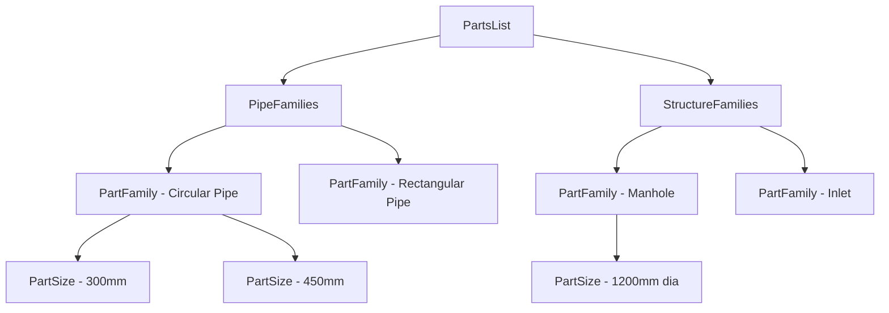

# PartsList

**Namespace:** `Autodesk.Civil.DatabaseServices`  
**Assembly:** `AeccDbMgd.dll`

## Overview

The `PartsList` class represents a catalog of pipe and structure parts that can be used in Civil3D pipe networks. It defines the available sizes, materials, and specifications for pipes and structures.

**Key Concept:** Parts lists are templates that define what pipe and structure components are available when designing pipe networks. They reference part families from the Parts Catalog.

## Class Hierarchy

```
Object
  └─ RXObject
      └─ DBObject
          └─ PartsList
```

## Key Properties

| Property | Type | Description |
|----------|------|-------------|
| `Name` | `string` | Gets/sets the parts list name |
| `Description` | `string` | Gets/sets the description |
| `PipeFamilies` | `PartFamilyCollection` | Gets the collection of pipe part families |
| `StructureFamilies` | `PartFamilyCollection` | Gets the collection of structure part families |

## Key Methods

| Method | Return Type | Description |
|--------|-------------|-------------|
| `GetPartFamilyIdByDomain(PartDomainType)` | `ObjectIdCollection` | Gets part families by domain (pipe/structure) |

## Common Usage Patterns

### 1. Listing All Parts Lists

```csharp
using Autodesk.Civil.ApplicationServices;
using Autodesk.Civil.DatabaseServices;
using Autodesk.AutoCAD.ApplicationServices;
using Autodesk.AutoCAD.DatabaseServices;
using Autodesk.AutoCAD.Runtime;

[CommandMethod("LISTPARTSLISTS")]
public void ListPartsLists()
{
    Document acDoc = Application.DocumentManager.MdiActiveDocument;
    Editor ed = acDoc.Editor;
    CivilDocument civilDoc = CivilApplication.ActiveDocument;
    
    if (civilDoc == null)
    {
        ed.WriteMessage("\nCivil3D document not available");
        return;
    }
    
    using (Transaction tr = civilDoc.Database.TransactionManager.StartTransaction())
    {
        // Access parts lists from the pipe network catalog
        ObjectIdCollection partsListIds = civilDoc.GetPartsListIds();
        
        ed.WriteMessage($"\n=== Parts Lists ({partsListIds.Count}) ===");
        
        foreach (ObjectId plId in partsListIds)
        {
            PartsList partsList = tr.GetObject(plId, OpenMode.ForRead) as PartsList;
            
            ed.WriteMessage($"\n\nParts List: {partsList.Name}");
            ed.WriteMessage($"\n  Description: {partsList.Description}");
            ed.WriteMessage($"\n  Pipe Families: {partsList.PipeFamilies.Count}");
            ed.WriteMessage($"\n  Structure Families: {partsList.StructureFamilies.Count}");
        }
        
        tr.Commit();
    }
}
```

### 2. Examining Pipe Part Families

```csharp
[CommandMethod("LISTPIPEFAMILIES")]
public void ListPipePartFamilies()
{
    Document acDoc = Application.DocumentManager.MdiActiveDocument;
    Editor ed = acDoc.Editor;
    CivilDocument civilDoc = CivilApplication.ActiveDocument;
    
    if (civilDoc == null) return;
    
    // Prompt for parts list selection
    PromptEntityOptions peo = new PromptEntityOptions("\nSelect a pipe network to view its parts list: ");
    PromptEntityResult per = ed.GetEntity(peo);
    if (per.Status != PromptStatus.OK) return;
    
    using (Transaction tr = civilDoc.Database.TransactionManager.StartTransaction())
    {
        Network network = tr.GetObject(per.ObjectId, OpenMode.ForRead) as Network;
        
        if (network == null)
        {
            ed.WriteMessage("\nSelected object is not a pipe network");
            tr.Commit();
            return;
        }
        
        ObjectId partsListId = network.PartsListId;
        PartsList partsList = tr.GetObject(partsListId, OpenMode.ForRead) as PartsList;
        
        ed.WriteMessage($"\n=== Pipe Families in '{partsList.Name}' ===");
        
        foreach (ObjectId familyId in partsList.PipeFamilies)
        {
            PartFamily family = tr.GetObject(familyId, OpenMode.ForRead) as PartFamily;
            
            ed.WriteMessage($"\n\nFamily: {family.Name}");
            ed.WriteMessage($"\n  Domain: {family.Domain}");
            ed.WriteMessage($"\n  Part Type: {family.PartType}");
            
            // List available sizes
            PartSizeCollection sizes = family.PartSizes;
            ed.WriteMessage($"\n  Available Sizes: {sizes.Count}");
            
            foreach (PartSize size in sizes)
            {
                ed.WriteMessage($"\n    - {size.Description}");
            }
        }
        
        tr.Commit();
    }
}
```

### 3. Examining Structure Part Families

```csharp
[CommandMethod("LISTSTRUCTFAMILIES")]
public void ListStructurePartFamilies()
{
    Document acDoc = Application.DocumentManager.MdiActiveDocument;
    Editor ed = acDoc.Editor;
    CivilDocument civilDoc = CivilApplication.ActiveDocument;
    
    if (civilDoc == null) return;
    
    using (Transaction tr = civilDoc.Database.TransactionManager.StartTransaction())
    {
        ObjectIdCollection partsListIds = civilDoc.GetPartsListIds();
        
        if (partsListIds.Count == 0)
        {
            ed.WriteMessage("\nNo parts lists found");
            tr.Commit();
            return;
        }
        
        // Use first parts list
        PartsList partsList = tr.GetObject(partsListIds[0], OpenMode.ForRead) as PartsList;
        
        ed.WriteMessage($"\n=== Structure Families in '{partsList.Name}' ===");
        
        foreach (ObjectId familyId in partsList.StructureFamilies)
        {
            PartFamily family = tr.GetObject(familyId, OpenMode.ForRead) as PartFamily;
            
            ed.WriteMessage($"\n\nFamily: {family.Name}");
            ed.WriteMessage($"\n  Part Type: {family.PartType}");
            
            // List available sizes
            PartSizeCollection sizes = family.PartSizes;
            ed.WriteMessage($"\n  Available Sizes:");
            
            foreach (PartSize size in sizes)
            {
                ed.WriteMessage($"\n    - {size.Description}");
            }
        }
        
        tr.Commit();
    }
}
```

### 4. Finding Specific Part Sizes

```csharp
[CommandMethod("FINDPIPESIZE")]
public void FindPipeSize()
{
    Document acDoc = Application.DocumentManager.MdiActiveDocument;
    Editor ed = acDoc.Editor;
    CivilDocument civilDoc = CivilApplication.ActiveDocument;
    
    if (civilDoc == null) return;
    
    // Prompt for diameter
    PromptDoubleOptions pdo = new PromptDoubleOptions("\nEnter pipe diameter to search for: ");
    pdo.DefaultValue = 300.0; // 300mm
    pdo.AllowNegative = false;
    pdo.AllowZero = false;
    
    PromptDoubleResult pdr = ed.GetDouble(pdo);
    if (pdr.Status != PromptStatus.OK) return;
    
    double searchDiameter = pdr.Value;
    
    using (Transaction tr = civilDoc.Database.TransactionManager.StartTransaction())
    {
        ObjectIdCollection partsListIds = civilDoc.GetPartsListIds();
        
        ed.WriteMessage($"\n=== Searching for {searchDiameter}mm pipes ===");
        
        foreach (ObjectId plId in partsListIds)
        {
            PartsList partsList = tr.GetObject(plId, OpenMode.ForRead) as PartsList;
            
            foreach (ObjectId familyId in partsList.PipeFamilies)
            {
                PartFamily family = tr.GetObject(familyId, OpenMode.ForRead) as PartFamily;
                
                foreach (PartSize size in family.PartSizes)
                {
                    // Check if this size matches our search
                    if (Math.Abs(size.InnerDiameter - searchDiameter) < 0.001)
                    {
                        ed.WriteMessage($"\n\nFound in: {partsList.Name}");
                        ed.WriteMessage($"\n  Family: {family.Name}");
                        ed.WriteMessage($"\n  Size: {size.Description}");
                        ed.WriteMessage($"\n  Inner Diameter: {size.InnerDiameter}mm");
                        ed.WriteMessage($"\n  Outer Diameter: {size.OuterDiameter}mm");
                    }
                }
            }
        }
        
        tr.Commit();
    }
}
```

### 5. Creating Parts List Report

```csharp
[CommandMethod("PARTSREPORT")]
public void CreatePartsListReport()
{
    Document acDoc = Application.DocumentManager.MdiActiveDocument;
    Editor ed = acDoc.Editor;
    CivilDocument civilDoc = CivilApplication.ActiveDocument;
    
    if (civilDoc == null) return;
    
    using (Transaction tr = civilDoc.Database.TransactionManager.StartTransaction())
    {
        ObjectIdCollection partsListIds = civilDoc.GetPartsListIds();
        
        ed.WriteMessage("\n╔════════════════════════════════════════╗");
        ed.WriteMessage("\n║     PARTS LIST SUMMARY REPORT          ║");
        ed.WriteMessage("\n╚════════════════════════════════════════╝");
        
        foreach (ObjectId plId in partsListIds)
        {
            PartsList partsList = tr.GetObject(plId, OpenMode.ForRead) as PartsList;
            
            ed.WriteMessage($"\n\n┌─ {partsList.Name} ─┐");
            ed.WriteMessage($"\n│ Description: {partsList.Description}");
            
            // Pipe families summary
            ed.WriteMessage($"\n│");
            ed.WriteMessage($"\n│ PIPE FAMILIES ({partsList.PipeFamilies.Count}):");
            
            foreach (ObjectId familyId in partsList.PipeFamilies)
            {
                PartFamily family = tr.GetObject(familyId, OpenMode.ForRead) as PartFamily;
                ed.WriteMessage($"\n│   • {family.Name} ({family.PartSizes.Count} sizes)");
            }
            
            // Structure families summary
            ed.WriteMessage($"\n│");
            ed.WriteMessage($"\n│ STRUCTURE FAMILIES ({partsList.StructureFamilies.Count}):");
            
            foreach (ObjectId familyId in partsList.StructureFamilies)
            {
                PartFamily family = tr.GetObject(familyId, OpenMode.ForRead) as PartFamily;
                ed.WriteMessage($"\n│   • {family.Name} ({family.PartSizes.Count} sizes)");
            }
            
            ed.WriteMessage($"\n└────────────────────────────────────────┘");
        }
        
        tr.Commit();
    }
}
```

### 6. Network Parts List Association

```csharp
[CommandMethod("NETWORKPARTS")]
public void ShowNetworkPartsList()
{
    Document acDoc = Application.DocumentManager.MdiActiveDocument;
    Editor ed = acDoc.Editor;
    CivilDocument civilDoc = CivilApplication.ActiveDocument;
    
    if (civilDoc == null) return;
    
    using (Transaction tr = civilDoc.Database.TransactionManager.StartTransaction())
    {
        ObjectIdCollection networkIds = civilDoc.GetPipeNetworkIds();
        
        ed.WriteMessage("\n=== Pipe Networks and Their Parts Lists ===");
        
        foreach (ObjectId networkId in networkIds)
        {
            Network network = tr.GetObject(networkId, OpenMode.ForRead) as Network;
            PartsList partsList = tr.GetObject(network.PartsListId, OpenMode.ForRead) as PartsList;
            
            ed.WriteMessage($"\n\nNetwork: {network.Name}");
            ed.WriteMessage($"\n  Parts List: {partsList.Name}");
            ed.WriteMessage($"\n  Available Pipe Types: {partsList.PipeFamilies.Count}");
            ed.WriteMessage($"\n  Available Structure Types: {partsList.StructureFamilies.Count}");
            
            // Show what's actually used in the network
            ObjectIdCollection pipeIds = network.GetPipeIds();
            ObjectIdCollection structureIds = network.GetStructureIds();
            
            ed.WriteMessage($"\n  Pipes in Network: {pipeIds.Count}");
            ed.WriteMessage($"\n  Structures in Network: {structureIds.Count}");
        }
        
        tr.Commit();
    }
}
```

## Parts List Hierarchy



## Best Practices

1. **Check availability**: Always verify parts list exists before accessing
2. **Use appropriate domain**: Filter by `PartDomainType.Pipe` or `PartDomainType.Structure`
3. **Validate sizes**: Check that required sizes exist in the parts list
4. **Network association**: Each network references one parts list
5. **Read-only access**: Parts lists are typically read-only in code

## Common Patterns

### Pattern 1: Get Network's Parts List
```csharp
Network network = tr.GetObject(networkId, OpenMode.ForRead) as Network;
PartsList partsList = tr.GetObject(network.PartsListId, OpenMode.ForRead) as PartsList;
```

### Pattern 2: Iterate Part Families
```csharp
foreach (ObjectId familyId in partsList.PipeFamilies)
{
    PartFamily family = tr.GetObject(familyId, OpenMode.ForRead) as PartFamily;
    // Process family
}
```

### Pattern 3: Find Specific Size
```csharp
foreach (PartSize size in family.PartSizes)
{
    if (size.InnerDiameter == targetDiameter)
    {
        // Found matching size
    }
}
```

## Related Classes

- [Network](Network.md) - Pipe network that uses parts list
- [Pipe](Pipe.md) - Pipe using parts from parts list
- [Structure](Structure.md) - Structure using parts from parts list
- [CivilDocument](../Core/CivilDocument.md) - Contains parts lists

## See Also

- [Autodesk Official Documentation](https://help.autodesk.com/view/CIV3D/2024/ENU/?guid=GUID-PartsList)
- [Parts Catalog Documentation](https://help.autodesk.com/view/CIV3D/2024/ENU/?guid=GUID-PartsCatalog)
